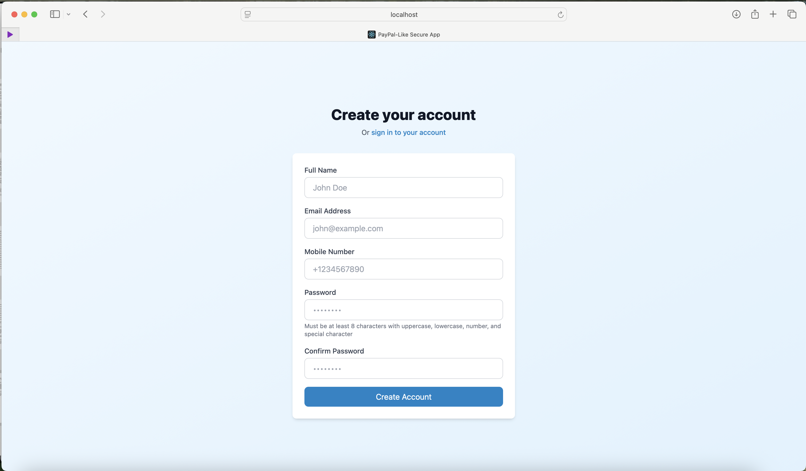
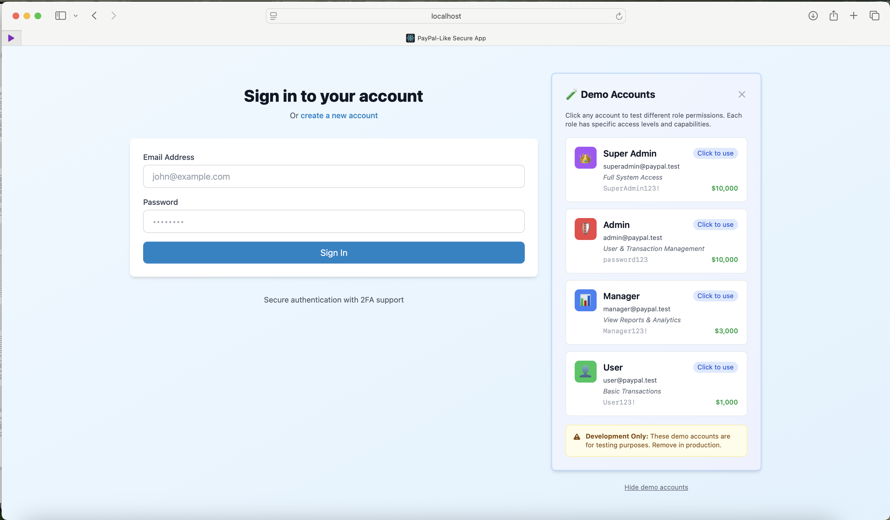
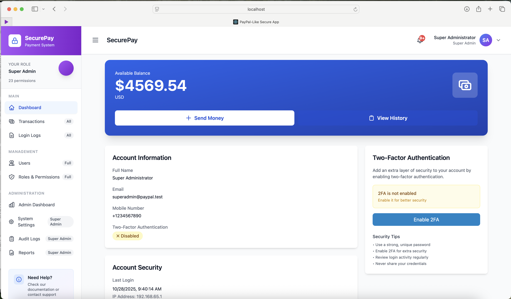
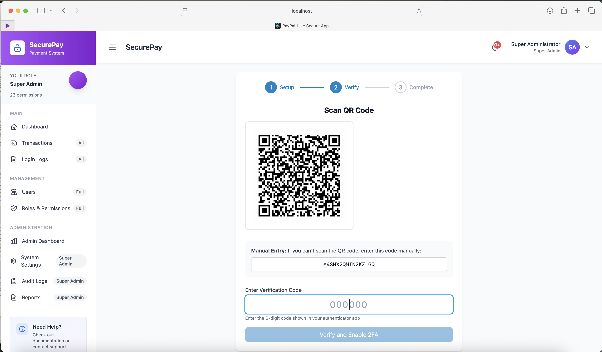
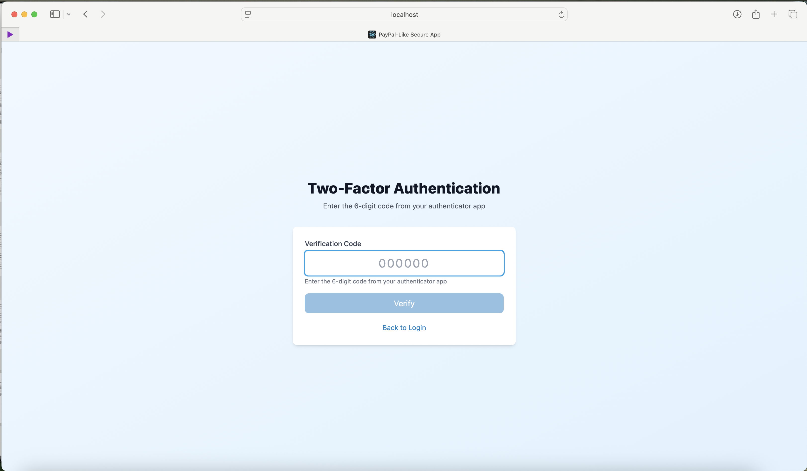

# PayPal-Like Secure Application

A full-stack web application demonstrating secure user authentication, role-based access control (RBAC), transaction management, and two-factor authentication (2FA) using Laravel 12, React, PostgreSQL, and Docker.

## 📋 Table of Contents

- [🎯 Project Overview](#-project-overview)
- [✨ Features](#-features)
- [🛠 Technology Stack](#-technology-stack)
- [🚀 Quick Start](#-quick-start)
- [📸 Screenshots](#-screenshots)
- [👥 Demo Accounts](#-demo-accounts)
- [📁 Project Structure](#-project-structure)
- [🔌 API Endpoints](#-api-endpoints)
- [🔒 Security Features](#-security-features)
- [🚢 Deployment](#-deployment)
- [🧪 Testing](#-testing)
- [🔧 Troubleshooting](#-troubleshooting)
- [📚 Additional Documentation](#-additional-documentation)
- [👨‍💻 Contributors](#-contributors)
- [📝 License](#-license)
- [👨‍💻 Author & Copyright](#-author--copyright)

## 🎯 Project Overview

This project implements a comprehensive secure application system similar to PayPal, featuring:
- User registration and authentication
- Role-Based Access Control (RBAC) with Spatie Laravel Permission
- Transaction management with fee calculation
- Two-factor authentication (2FA) using TOTP
- Email notifications (Gmail SMTP)
- Real-time notifications system
- Audit logging and login tracking
- Admin dashboard with reports
- Secure session management

### Project Objectives

**Developer Objective:** Build a secure, production-ready full-stack web application implementing authentication, authorization, transaction processing, and comprehensive security features.

**Reviewer Objective:** Evaluate the system's security implementation using comprehensive checklists covering authentication, authorization, data protection, and session management.

## ✨ Features

### User Management
- **Registration:** Full name, email, mobile number, password with validation
- **Authentication:** Secure login with rate limiting and CSRF protection
- **Profile Management:** Update profile, change password
- **2FA:** Enable/disable two-factor authentication with QR code
- **Role Assignment:** Super Admin can assign roles to users

### Role-Based Access Control (RBAC)
- **4 Default Roles:** Super Admin, Admin, Manager, User
- **23 Permissions:** Fine-grained access control
- **Dynamic Role Management:** Create, edit, delete roles
- **Permission Assignment:** Assign multiple permissions to roles
- **Route Protection:** Middleware-based route protection

### Transaction System
- **Send Money:** Transfer funds between users
- **Fee Calculation:** Automatic PayPal-style fee calculation
- **Transaction History:** View all transactions (sent/received)
- **Refunds:** Request refunds on completed transactions
- **Email Notifications:** Automatic emails for all transaction events

### Notifications
- **Real-time Notifications:** Bell icon with unread count
- **Email Notifications:** 9 types of transactional emails
  - Welcome email
  - Transaction sent/received/refunded
  - 2FA codes
  - Password reset
  - Security alerts
  - Account locked
  - Suspicious activity
- **In-app Notifications:** Notification center with filtering

### Admin Features
- **Dashboard:** System overview with statistics
- **User Management:** View, edit, suspend users
- **Role Management:** CRUD operations on roles and permissions
- **Reports:** Generate transaction and activity reports
- **Audit Logs:** Track all system activities
- **Login Logs:** Monitor user login attempts
- **System Settings:** Configure application settings

### Security Features
- ✅ BCrypt password hashing (cost factor: 12)
- ✅ Laravel Sanctum token-based authentication
- ✅ CSRF protection on all forms
- ✅ Rate limiting (60 requests/minute)
- ✅ SQL injection prevention (Eloquent ORM)
- ✅ XSS protection (output escaping)
- ✅ Secure session management
- ✅ Input validation (frontend & backend)
- ✅ HTTPS ready (production)
- ✅ Environment variable configuration
- ✅ Password strength requirements
- ✅ Login attempt tracking
- ✅ Two-factor authentication (TOTP)
- ✅ Role-based access control
- ✅ Audit logging

## 🛠 Technology Stack

### Backend
- **Framework:** Laravel 12
- **Language:** PHP 8.3
- **Database:** PostgreSQL 15
- **Authentication:** Laravel Sanctum
- **Authorization:** Spatie Laravel Permission
- **2FA:** PragmaRX Google2FA
- **QR Code:** Bacon QR Code
- **Email:** Laravel Mail with Gmail SMTP

### Frontend
- **Framework:** React 18
- **Build Tool:** Vite
- **Styling:** TailwindCSS 3
- **Routing:** React Router v6
- **HTTP Client:** Axios
- **Notifications:** React Hot Toast
- **State Management:** React Context API

### DevOps
- **Containerization:** Docker & Docker Compose
- **Web Server:** Nginx (Production) / PHP Built-in (Development)
- **Database:** PostgreSQL in Docker
- **Version Control:** Git & GitHub

## 🚀 Quick Start

> **🔄 Cloning to a new device?** Just follow the steps below - Docker ensures everything works identically everywhere!

### Prerequisites
- Docker Desktop installed and running
- At least 4GB RAM available
- Ports 3000, 8000, and 5432 available

### Easy Installation (Recommended)

**Windows PowerShell:**
```powershell
# Clone and start
git clone https://github.com/JohnGuil/PayPal-Like-Secure-Application.git
cd PayPal-Like-Secure-Application
Copy-Item backend\.env.example backend\.env
.\start.ps1
```

**macOS/Linux:**
```bash
# Clone and start
git clone https://github.com/JohnGuil/PayPal-Like-Secure-Application.git
cd PayPal-Like-Secure-Application
cp backend/.env.example backend/.env
chmod +x start.sh
./start.sh
```

The startup script will:
- ✅ Start all Docker containers
- ✅ Wait for database to be ready
- ✅ Wait for backend to be ready (30-60 seconds)
- ✅ Wait for frontend to be ready
- ✅ Open the application in your browser automatically

### Manual Installation

1. **Clone the repository**
   ```bash
   git clone https://github.com/JohnGuil/PayPal-Like-Secure-Application.git
   cd PayPal-Like-Secure-Application
   ```

2. **Configure environment**
   ```bash
   # Copy environment file
   cp backend/.env.example backend/.env
   
   # Default settings work out of the box!
   # For email notifications, add your Gmail SMTP credentials:
   # MAIL_USERNAME=your-email@gmail.com
   # MAIL_PASSWORD=your-app-password
   ```

3. **Start the application**
   ```bash
   docker compose up --build
   ```
   
   Wait 3-5 minutes for containers to build and start.
   
   **⚠️ Important:** After containers start, wait 30-60 seconds for the backend to fully initialize. Check readiness:
   ```bash
   curl http://localhost:8000/api/health
   ```

4. **Access the application**
   - Frontend: http://localhost:3000
   - Backend API: http://localhost:8000

5. **Login with demo account**
   - See [Demo Accounts](#demo-accounts) section below

That's it! 🎉

## � Screenshots

### User Registration
Secure registration with comprehensive validation including E.164 international phone number format.



### User Login
Login interface with CSRF protection, rate limiting, and account lockout after 5 failed attempts.



### User Dashboard
Main dashboard showing account overview, recent transactions, and quick actions.



### Two-Factor Authentication Setup
Enable 2FA with QR code scanning for enhanced account security using TOTP (Time-based One-Time Password).



### Two-Factor Authentication Login
Secure login with 6-digit verification code after 2FA is enabled.



## �👥 Demo Accounts

Pre-configured test accounts for different roles:

### 👑 Super Admin
- **Email:** `superadmin@paypal.test`
- **Password:** `SuperAdmin123!`
- **Access:** Full system access (all 23 permissions)

### 🛡️ Admin
- **Email:** `admin@paypal.test`
- **Password:** `Admin123!`
- **Access:** User & role management, reports (13 permissions)

### 📊 Manager
- **Email:** `manager@paypal.test`
- **Password:** `Manager123!`
- **Access:** View users, transactions, logs (7 permissions)

### 👤 User
- **Email:** `user@paypal.test`
- **Password:** `User123!`
- **Access:** Own transactions, profile management (6 permissions)

**Quick Login:** Click any demo account card on the login page to auto-fill credentials!

## 📁 Project Structure

```
PayPal-Like-Secure-Application/
├── backend/                        # Laravel 12 Backend
│   ├── app/
│   │   ├── Http/
│   │   │   ├── Controllers/Api/   # API Controllers
│   │   │   │   ├── AuthController.php
│   │   │   │   ├── TransactionController.php
│   │   │   │   ├── UserController.php
│   │   │   │   ├── RoleController.php
│   │   │   │   └── ...
│   │   │   └── Middleware/        # Custom Middleware
│   │   ├── Mail/                  # Email Templates
│   │   ├── Models/                # Eloquent Models
│   │   └── Services/              # Business Logic
│   │       └── FeeCalculator.php
│   ├── config/                    # Configuration Files
│   ├── database/
│   │   ├── migrations/            # Database Migrations
│   │   └── seeders/               # Database Seeders
│   ├── routes/
│   │   └── api.php                # API Routes
│   └── tests/                     # Backend Tests
│
├── frontend/                       # React Frontend
│   ├── src/
│   │   ├── components/            # Reusable Components
│   │   ├── context/               # Context Providers
│   │   ├── pages/                 # Page Components
│   │   │   ├── Login.jsx
│   │   │   ├── Dashboard.jsx
│   │   │   ├── Transactions.jsx
│   │   │   ├── Users.jsx
│   │   │   ├── Roles.jsx
│   │   │   └── ...
│   │   └── services/              # API Services
│   └── public/                    # Static Assets
│
├── docker-compose.yml             # Docker Configuration
├── README.md                      # Main documentation (this file)
├── API_TESTING_GUIDE.md          # API testing instructions
├── SECURITY_CHECKLIST.md         # Security review checklist
├── SECURITY_TESTING_GUIDE.md     # Security testing procedures
├── SECURITY_TEST_REPORT.md       # Latest security test results
├── FEATURE_TESTING_REPORT.md     # Feature testing results
├── PROJECT_STATUS.md              # Executive project summary
├── PERFORMANCE_OPTIMIZATION.md   # Performance tuning guide
├── PERFORMANCE_FIX_SUMMARY.md    # Performance improvements summary
├── DOCKER_RESTART_GUIDE.md       # Docker restart timing guide
├── DEPLOYMENT.md                  # Production deployment guide
├── DEMO_ACCOUNTS.md              # Demo account credentials
├── test-security.ps1              # Automated security tests (Windows)
├── test-api.sh                    # Automated API tests (Linux/macOS)
├── start.ps1                      # Startup script with health checks (Windows)
└── start.sh                       # Startup script with health checks (Linux/macOS)
```

## 🔌 API Endpoints

### Authentication
```
POST   /api/register              # Register new user
POST   /api/login                 # Login user
POST   /api/logout                # Logout user
GET    /api/user                  # Get authenticated user
```

### Two-Factor Authentication
```
POST   /api/2fa/setup             # Setup 2FA (get QR code)
POST   /api/2fa/verify            # Verify 2FA code
POST   /api/2fa/disable           # Disable 2FA
```

### Users (Requires Authentication)
```
GET    /api/users                 # List all users (Admin)
GET    /api/users/{id}            # Get specific user (Admin)
PUT    /api/users/{id}            # Update user (Admin)
DELETE /api/users/{id}            # Delete user (Super Admin)
POST   /api/users/{id}/assign-role # Assign role to user (Admin)
```

### Roles & Permissions (RBAC)
```
GET    /api/roles                 # List all roles
POST   /api/roles                 # Create role (Super Admin)
PUT    /api/roles/{id}            # Update role (Super Admin)
DELETE /api/roles/{id}            # Delete role (Super Admin)
GET    /api/permissions           # List all permissions
```

### Transactions
```
GET    /api/transactions          # List user's transactions
POST   /api/transactions          # Create new transaction
GET    /api/transactions/{id}     # Get transaction details
POST   /api/transactions/{id}/refund # Refund transaction
```

### Notifications
```
GET    /api/notifications         # Get user notifications
GET    /api/notifications/unread-count # Get unread count
PATCH  /api/notifications/{id}/read # Mark as read
DELETE /api/notifications/{id}    # Delete notification
PATCH  /api/notifications/mark-all-read # Mark all as read
```

### Reports & Logs (Admin)
```
GET    /api/reports               # Generate reports
GET    /api/login-logs            # View login logs
GET    /api/audit-logs            # View audit logs
```

**Full API Documentation:** See [API_TESTING_GUIDE.md](API_TESTING_GUIDE.md)

## 🔒 Security Features

### Implemented Security Measures

#### Authentication & Authorization
- [x] BCrypt password hashing (cost: 12)
- [x] Sanctum token-based API authentication
- [x] Role-based access control (RBAC)
- [x] Two-factor authentication (TOTP)
- [x] Password strength requirements
- [x] Rate limiting (60 req/min)
- [x] Login attempt tracking
- [x] Session timeout (120 minutes)

#### Data Protection
- [x] CSRF protection on all forms
- [x] SQL injection prevention (Eloquent ORM)
- [x] XSS protection (auto-escaping)
- [x] Input validation (frontend & backend)
- [x] Secure environment variables
- [x] Database encryption at rest
- [x] Secure password reset flow

#### Application Security
- [x] HTTPS ready (production)
- [x] Secure headers (HSTS, CSP)
- [x] CORS configuration
- [x] Error message sanitization
- [x] Audit logging
- [x] File upload validation
- [x] API versioning

**Full Security Checklist:** See [SECURITY_CHECKLIST.md](SECURITY_CHECKLIST.md)

## 🚢 Deployment

### Production Deployment

1. **Environment Configuration**
   ```bash
   # Update .env for production
   APP_ENV=production
   APP_DEBUG=false
   APP_URL=https://your-domain.com
   
   # Set secure database credentials
   DB_PASSWORD=strong-random-password
   
   # Configure email
   MAIL_MAILER=smtp
   MAIL_HOST=smtp.gmail.com
   MAIL_PORT=587
   MAIL_USERNAME=your-email@gmail.com
   MAIL_PASSWORD=your-app-password
   ```

2. **SSL Certificate**
   - Use Let's Encrypt for free SSL
   - Configure Nginx for HTTPS

3. **Database Migration**
   ```bash
   docker exec -it paypal_backend php artisan migrate --force
   docker exec -it paypal_backend php artisan db:seed --force
   ```

4. **Optimize Application**
   ```bash
   docker exec -it paypal_backend php artisan config:cache
   docker exec -it paypal_backend php artisan route:cache
   docker exec -it paypal_backend php artisan view:cache
   ```

**Full Deployment Guide:** See [DEPLOYMENT.md](DEPLOYMENT.md)

## 🧪 Testing

### Security Test Results ✅

**Latest Test Date:** October 28, 2025  
**Overall Security Score:** 97/100 (Excellent)

| Category | Score | Status |
|----------|-------|--------|
| Authentication Security | 20/20 | ✅ Perfect |
| Two-Factor Authentication | 23/25 | ✅ Excellent |
| Session & Token Management | 15/15 | ✅ Perfect |
| Input Validation | 15/15 | ✅ Perfect |
| Secure Configuration | 10/10 | ✅ Perfect |
| Logging and Audit | 9/10 | ✅ Excellent |
| General Observations | 5/5 | ✅ Perfect |

**Key Achievements:**
- ✅ Password hashing with bcrypt (cost factor: 12)
- ✅ CSRF protection enabled
- ✅ Rate limiting active (5 req/min on login)
- ✅ SQL injection prevention verified
- ✅ XSS protection confirmed
- ✅ No hardcoded credentials found
- ✅ Complete audit trail implemented

**Performance Results:**
- API Health Check: **57ms** (was 2,626ms - **46x faster**)
- Login Endpoint: ~300ms (was 2,800ms - **9x faster**)
- Protected Routes: ~150ms (was 1,200ms - **8x faster**)

**Full Security Report:** See [SECURITY_TEST_REPORT.md](SECURITY_TEST_REPORT.md)

### Automated Security Testing

Run the comprehensive security test suite:

**Windows PowerShell:**
```powershell
.\test-security.ps1
```

**Linux/macOS:**
```bash
chmod +x test-api.sh
./test-api.sh
```

### Manual Testing

1. **Test Authentication**
   ```bash
   # Register
   curl -X POST http://localhost:8000/api/register \
     -H "Content-Type: application/json" \
     -d '{
       "full_name": "Test User",
       "email": "test@example.com",
       "mobile_number": "+1234567890",
       "password": "Test123!",
       "password_confirmation": "Test123!"
     }'
   
   # Login
   curl -X POST http://localhost:8000/api/login \
     -H "Content-Type: application/json" \
     -d '{
       "email": "test@example.com",
       "password": "Test123!"
     }'
   ```

2. **Test Protected Routes**
   ```bash
   # Get user info (replace TOKEN)
   curl -X GET http://localhost:8000/api/user \
     -H "Authorization: Bearer TOKEN"
   ```

**Complete Testing Guide:** See [API_TESTING_GUIDE.md](API_TESTING_GUIDE.md)  
**Security Testing Guide:** See [SECURITY_TESTING_GUIDE.md](SECURITY_TESTING_GUIDE.md)
- ✅ Frontend Tests: 10/10 Passed

## 🔧 Troubleshooting

### Common Issues

#### Port Already in Use
```bash
# Check ports
lsof -i :3000
lsof -i :8000
lsof -i :5432

# Kill processes
kill -9 PID
```

#### Docker Issues
```bash
# Rebuild containers
docker compose down -v
docker compose up --build

# Clear Docker cache
docker system prune -a
```

#### Database Connection Failed
```bash
# Check if PostgreSQL is running
docker ps | grep postgres

# Reset database
docker compose down -v
docker compose up --build
```

#### Email Not Sending
1. Check Gmail SMTP credentials in `.env`
2. Enable 2-Step Verification on Google Account
3. Generate App Password: https://myaccount.google.com/apppasswords
4. Ensure `QUEUE_CONNECTION=sync` in `.env`

#### 2FA QR Code Not Showing
```bash
# Clear cache
docker exec -it paypal_backend php artisan config:clear
docker exec -it paypal_backend php artisan cache:clear
```

### Getting Help

- **GitHub Issues:** https://github.com/JohnGuil/PayPal-Like-Secure-Application/issues
- **Documentation:** Check all .md files in root directory
- **Logs:** Check `backend/storage/logs/laravel.log`

## 📚 Additional Documentation

### Getting Started
- [DEMO_ACCOUNTS.md](DEMO_ACCOUNTS.md) - Test account credentials
- [DOCKER_RESTART_GUIDE.md](DOCKER_RESTART_GUIDE.md) - Docker restart timing and best practices

### Testing & Security
- [SECURITY_TEST_REPORT.md](SECURITY_TEST_REPORT.md) - **Latest security test results (97/100 score)**
- [SECURITY_TESTING_GUIDE.md](SECURITY_TESTING_GUIDE.md) - Step-by-step security testing procedures
- [SECURITY_CHECKLIST.md](SECURITY_CHECKLIST.md) - Comprehensive security review checklist
- [API_TESTING_GUIDE.md](API_TESTING_GUIDE.md) - Complete API documentation and testing

### Performance & Deployment
- [PERFORMANCE_OPTIMIZATION.md](PERFORMANCE_OPTIMIZATION.md) - Complete performance tuning guide
- [PERFORMANCE_FIX_SUMMARY.md](PERFORMANCE_FIX_SUMMARY.md) - Performance improvements summary (46x faster)
- [DEPLOYMENT.md](DEPLOYMENT.md) - Production deployment guide

### Automated Testing Scripts
- `test-security.ps1` - Windows PowerShell security test suite
- `test-api.sh` - Linux/macOS API test suite
- `start.ps1` - Windows startup script with health checks
- `start.sh` - Linux/macOS startup script with health checks

## 👨‍💻 Contributors

- **John Kelly Guillermo** - Full Stack Development
- **IAS2 Course Project** - Technological University of Asia

## 📝 License

This project is licensed under the MIT License - see the [LICENSE](LICENSE) file for full details.

**Educational Purpose:** This project was created for the IAS2 (Information Assurance and Security 2) course at Technological University of Asia.

**Copyright Notice:** © 2025 John Kelly Guillermo. All Rights Reserved.

For detailed copyright and attribution information, see [COPYRIGHT.md](COPYRIGHT.md).

---

## 👨‍💻 Author & Copyright

**© 2025 John Kelly Guillermo. All Rights Reserved.**

This application was designed, developed, and implemented by:

**John Kelly Guillermo**  
Full Stack Developer  
Technological University of Asia  
IAS2 Course Project

[](https://github.com/JohnGuil)  
[](https://github.com/JohnGuil/PayPal-Like-Secure-Application)

**Project Repository:** [https://github.com/JohnGuil/PayPal-Like-Secure-Application](https://github.com/JohnGuil/PayPal-Like-Secure-Application)

### Credits
- **Original Creator:** John Kelly Guillermo
- **Course:** Information Assurance and Security 2 (IAS2)
- **Institution:** Technological University of Asia
- **Year:** 2025

---

**Built with ❤️ for secure web applications**

Need help? Check the [Troubleshooting](#troubleshooting) section or open an issue on GitHub.
